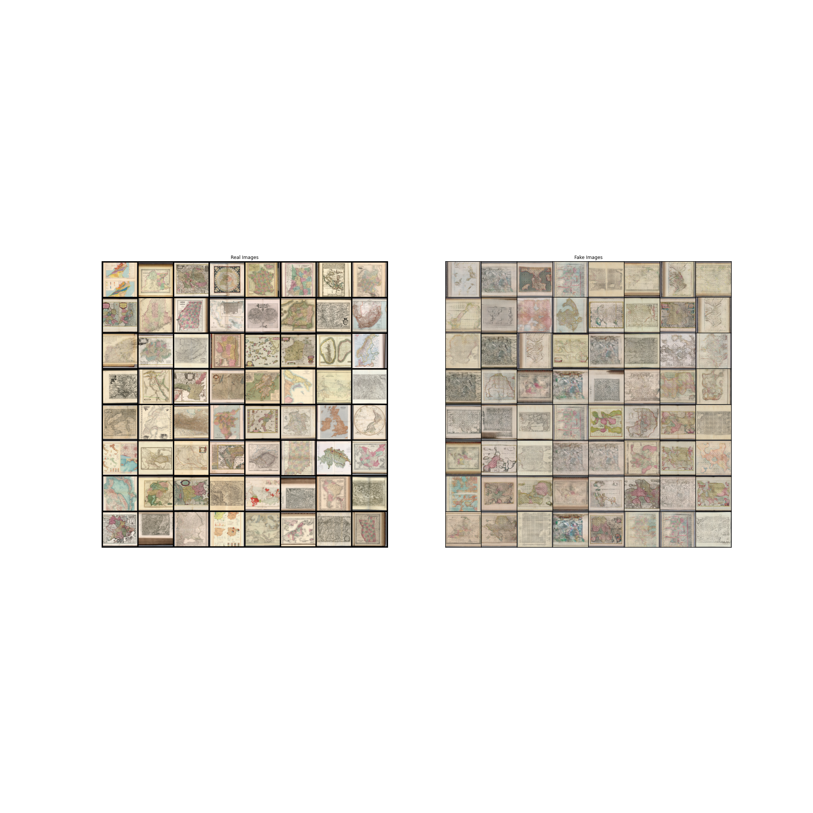

# Map-GAN-erator

This project is an attempt to create a generative adversarial network to generate fake maps in various styles.
Currently, we have implemented DCGAN and used data from the [David Rumsey](https://www.davidrumsey.com/) map collection.

## Sample outputs

Below are example outputs at a few different training lengths.
On the left are sample input images, and on the right are sample outputs.

Here are example outputs at 50 epochs of training

and at 500 epochs of training

